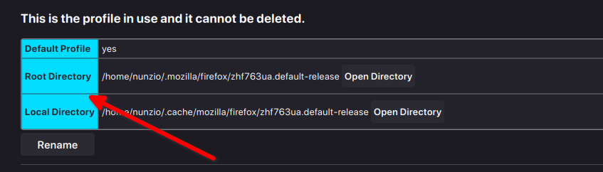

# Firefox-customization
## Problem

Poor readability of fonts in the various panels of the Firefox DevTool.

## Goal

Improve the readability of Firefox DevTool panels by modifying the fonts through a css file.

## Solution

1. Go to Firefox's advanced options by entering `about:config` in the address bar and set `toolkit.legacyUserProfileCustomizations.stylesheets` to `true`.
    
    This enabled option will allow the following CSS file to be used. 
    
2. Type in the address bar `about:profile` and check what is the default profile. If there is nothing and consider the root directory.
    
    
    
3. Inside this directory, create a directory with the name `chrome` and then put the following CSS file with the name `userContent.css`.
    
    ```css
    @-moz-document url-prefix(chrome://devtools/content/){
         .network-monitor {
             font-family:JetBrain Mono !important;
             font-size: 14px !important;
             line-height:3;
        }
    }
    ```
    
    The `url-prefix` rule applies the contained style rules to any page whose URL starts with it.
    
    `.network-monitor` is the class of the HTML div of the panel related to network monitoring.
    

In order to apply the rules to other specific panels of the dev tool, you need to know the class of the various dev html.

It can be useful to debug the Firefox devTool with another instance of the devTool itself.

You can follow this simple guide provided by Mozilla:

[Browser Toolbox - Firefox Source Docs documentation](https://firefox-source-docs.mozilla.org/devtools-user/browser_toolbox/index.html)